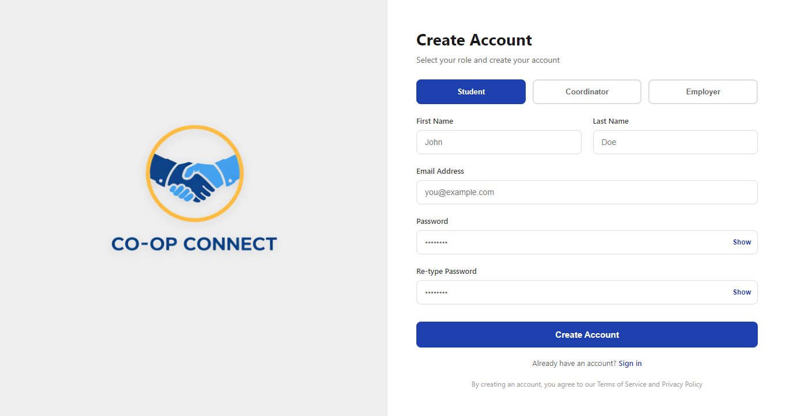
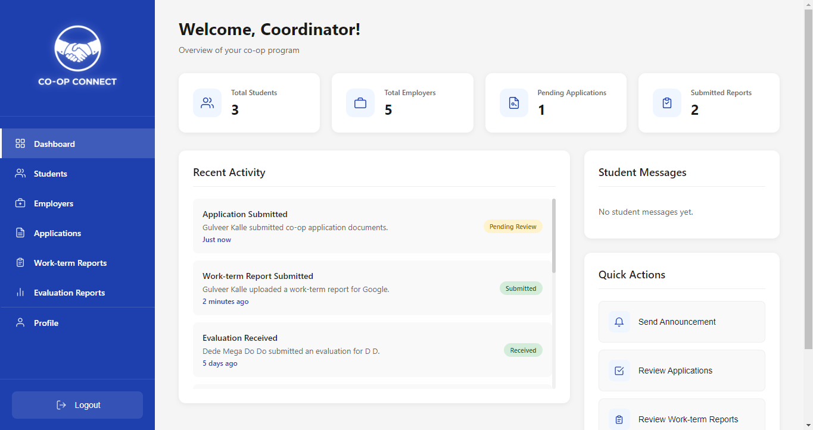
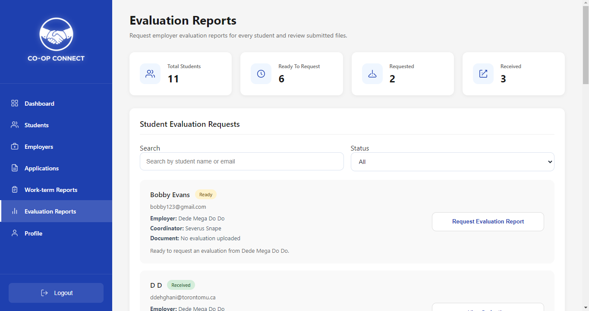
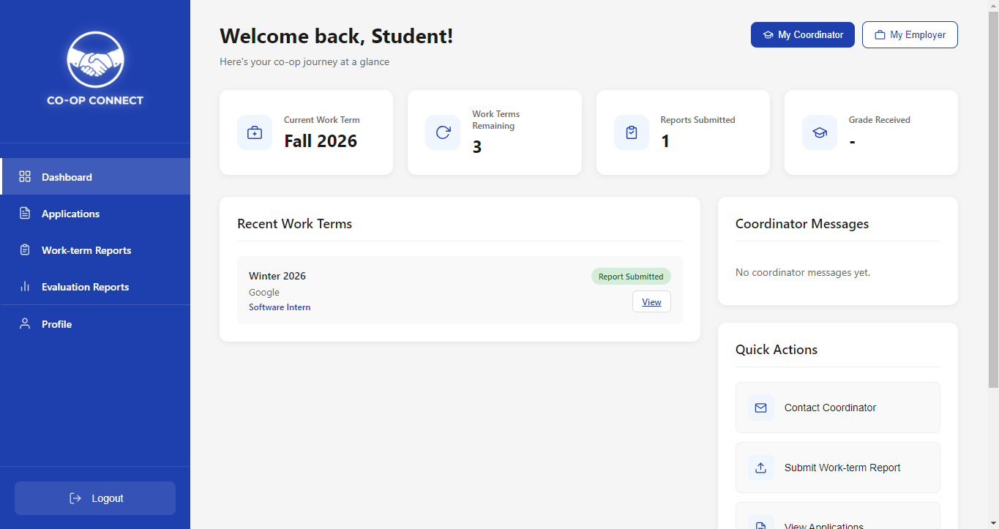
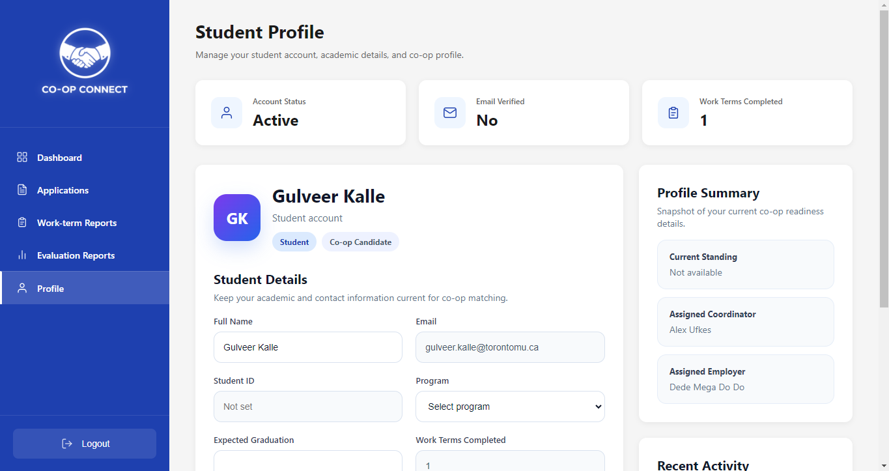
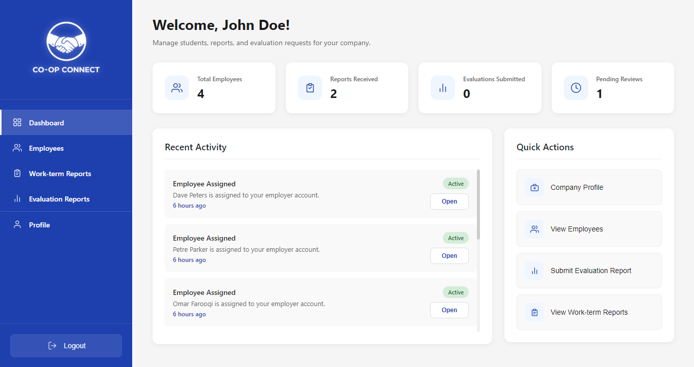
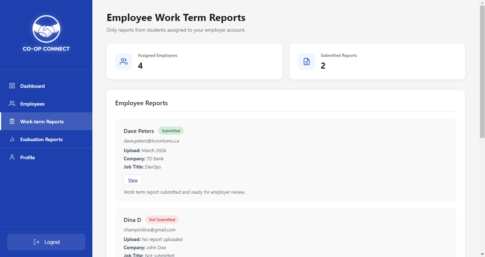

# 🎓 Co-op Connect - Co-op Management System

A desktop application designed to streamline co-op program management, connecting students, employers, and coordinators through a centralized, role-based platform.

---

## 📌 Description

**Co-op Connect** is a full-stack application that simplifies the co-op workflow by managing applications, work term reports, evaluations, and assignments in one place.

The system supports three distinct user roles **Students**, **Employers**, and **Co-op Coordinators**, each with a customized dashboard and set of tools tailored to their responsibilities.

Built using **Electron**, **Firebase**, and **Cloudinary**, the platform ensures secure authentication, real-time data handling, and efficient document management through PDF uploads.

---

## Features ✅

### 🔐 Authentication & Access
- Secure login using Firebase Authentication (email/password)
- Role-based redirection to personalized dashboards

### 🏠 Core System
- Desktop-first responsive interface
- Centralized system for applications, reports, and evaluations
- Real-time database updates using Firestore

### 👨‍🎓 Student Features
- 📝 Submit co-op applications (Resume + Letter of Intent)
- 📊 Track application status:
  - Pending  
  - Rejected  
  - Accepted  
- 📄 Upload work term reports (PDF)
- 🧾 View grades and coordinator feedback
- 🔗 View assigned coordinator and industry partner

### 🏢 Employer Features
- 👥 Manage assigned students
- 📈 Track student progress during work term
- 📋 Submit end-of-term evaluations

### 🧑‍💼 Coordinator Features
- ✅ Review and approve/reject applications
- 🔄 Assign students to partners and coordinators
- 📥 Track report submissions (student + partner)
- 📝 Provide feedback and final grades

---

## 🛠 Technologies Used

- **Electron** – Desktop application framework  
- **HTML, CSS, JavaScript** – Frontend and Backend development  
- **Firebase Authentication** – Secure login system  
- **Firestore** – NoSQL database for real-time data  
- **Cloudinary** – Cloud-based file storage and media management (PDF uploads)

---

## 📂 System Capabilities

- 📄 **PDF Upload & Management**
  - Resumes  
  - Letters of Intent  
  - Work Term Reports  
  - Evaluation Reports  
  - Stored securely using Firebase Storage & Cloudinary  

- 🔗 **Assignment Tracking**
  - Students linked with coordinators and industry partners  

- 🔐 **Secure Data Handling**
  - Authentication + protected user roles  

- 📊 **Role-Based Dashboards**
  - Customized UI and actions for each user type  

---

## 🖥 Setup and Run Locally (VS Code)

    git clone https://github.com/Gulveer-Kalle/Co-op-Connect.git
    npm install
    npm start

---

## 📸 Screenshots

> ⚠ Screenshots shown are from development previews and highlight select parts of the application rather than the complete system. The UI will continue to be refined.

### 🔐 Register

### 🧑‍💼 Coordinator

### 👨‍🎓 Student

### 🏢 Employer

---

## 🔮 Future Enhancements

- 🔔 Notifications & reminders for deadlines  
- 📤 Export dashboard reports (PDF/Excel)  
- 📅 Events & workshop management  
- 📓 Personal student journal feature  
- 📊 Advanced analytics for student performance  

---

## 💡 Project Highlights

- Full **role-based system design**
- Real-world workflow simulation of a university co-op program  
- Integration of **authentication, database, and cloud storage**  
- Scalable structure for future feature expansion